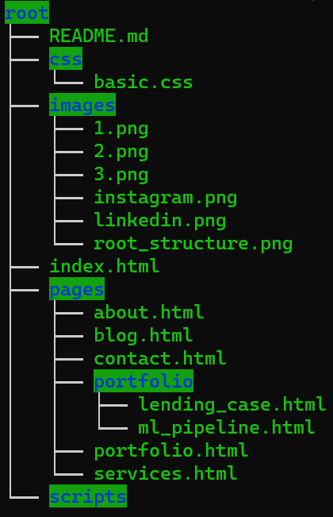

### Table of Contents

1. [Project Motivation](#motivation)
2. [Wireframe](#wireframe)
3. [File Descriptions](#files)
4. [Licensing, Authors, and Acknowledgements](#licensing)

## Project Motivation 

As part of my own learning path I am in the need of learning how to build more robust website using nothing but code.
Having little to no experience in web development I am currently pursuing CoderHouse's Full Stack Development Career.

In order to finish the CoderHouse's introductory course on Web Development I need to build a website on my own. In order to do so
I created this repo to track and show all my work done to the course's tutor and professor.

## Wireframe 

As part of the deliverables I needed to build a simple wireframe of the initial look. You can find it in the following
public figma design file. [Click here](https://www.figma.com/file/2cO2amEn5Eto9JYgylmH12/Wireframe).

## File Descriptions 

In this repo you will find all the pages, assets, stylesheets and scripts of my project which currently looks like this:

## Licensing, Authors, Acknowledgements 

Shout out to CoderHouse team for building such an amazing course and career! This code is for education purposes so feel
free to use it as a template as of today.